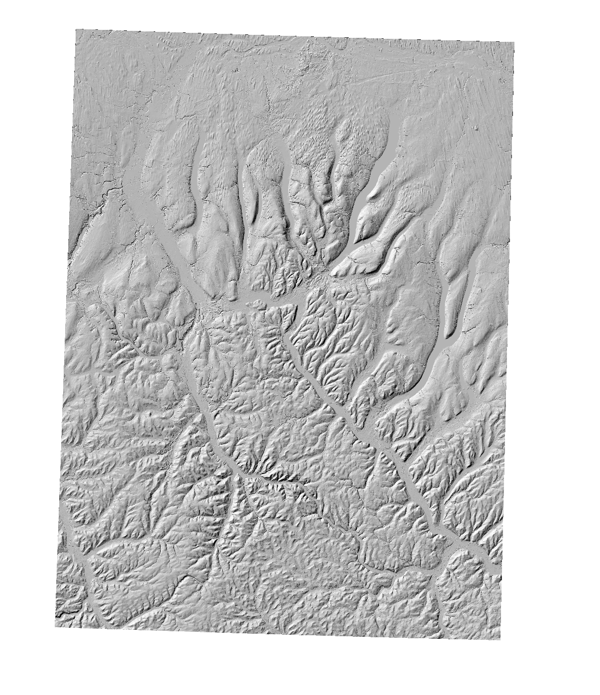

# DEM Terrain Analysis

Computes slope, aspect, and hillshade from a USGS 3DEP 1/3 arc-second DEM tile using GDAL processing algorithms via PyQGIS.

## Data Source

- **USGS 3DEP 1/3 Arc-Second DEM**: Download from [The National Map](https://apps.nationalmap.gov/downloader/)
- Select "Elevation Products (3DEP)" → 1/3 arc-second → choose tile covering Rochester, NY (n43w078)

## Workflow

1. Load raw DEM (geographic CRS, WGS 84)
2. Reproject to UTM Zone 18N (EPSG:32618) for metric calculations
3. Compute slope in degrees (`gdal:slope`)
4. Compute aspect (`gdal:aspect`)
5. Compute hillshade with 2× vertical exaggeration (`gdal:hillshade`)

## Output

| Layer | Description |
|-------|-------------|
| `dem_utm.tif` | Reprojected elevation model |
| `slope_degrees.tif` | Terrain slope (0–90°) |
| `aspect.tif` | Downslope direction (0–360°) |
| `hillshade.tif` | Shaded relief, azimuth 315°, altitude 45° |

## Screenshots

