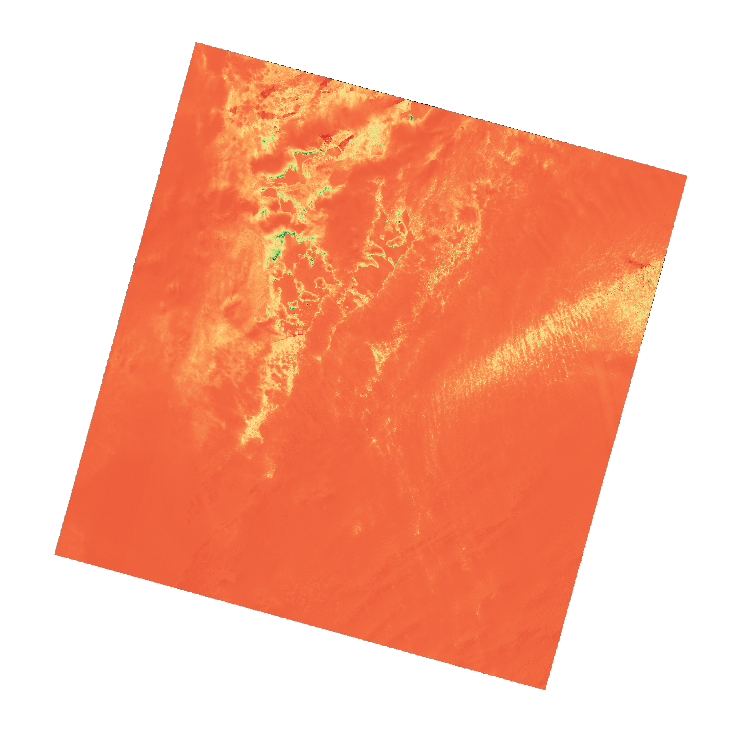
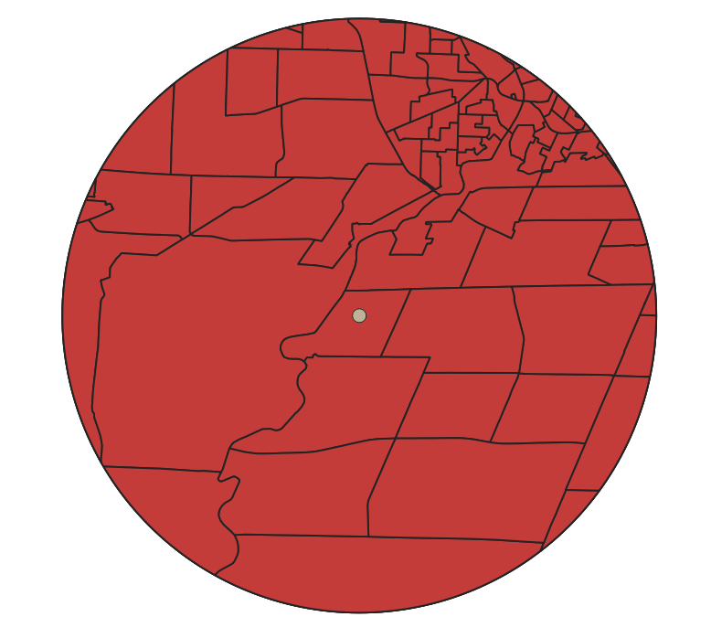
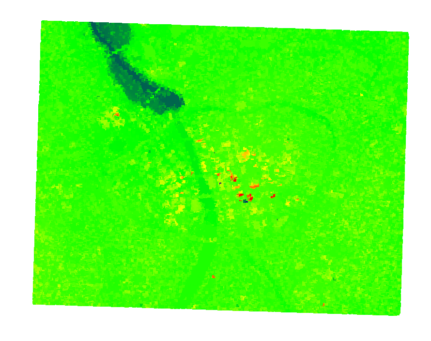

# QGIS Geospatial Analysis Portfolio

A collection of PyQGIS workflows demonstrating raster analysis, vector geoprocessing, remote sensing, and lidar point cloud visualization.

## Projects

### 1. DEM Terrain Analysis
Computes slope, aspect, and hillshade from a USGS 3DEP elevation model of the Rochester, NY region using GDAL/QGIS processing algorithms.

### 2. NDVI from Landsat 8
Calculates Normalized Difference Vegetation Index from Landsat 8 OLI bands, with a classified color ramp highlighting vegetation health.

### 3. Vector Geoprocessing
Performs buffer, clip, and spatial join operations on US Census TIGER/Line data to identify census tracts within a specified radius of a point of interest.

### 4. Lidar Point Cloud Visualization
Loads and renders a USGS 3DEP lidar point cloud (LAZ), classifying points by elevation and return number — connecting to my [M.S. thesis on 3D lidar voxel classification](https://scholarworks.rit.edu/).

## Environment

- **QGIS**: 3.34+ (LTR recommended)
- **Python**: PyQGIS 3.x (bundled with QGIS)
- **OS**: Tested on Fedora Linux (KDE Plasma) and Windows 11

## Author

**Yuval Levental**
M.S. Imaging Science, Rochester Institute of Technology
B.S. Electrical Engineering, Michigan State University

Expertise in computer vision, deep learning, remote sensing, and 3D point cloud analysis.
